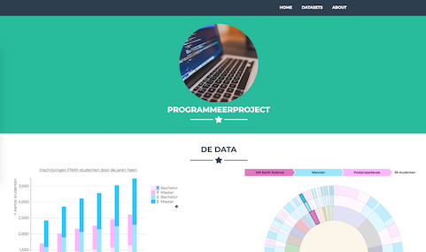
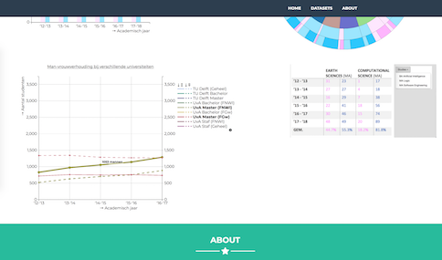

**OVERVIEW**
----------------  
**Vak**: Minor Programmeren: Programmeerproject 2018  
**Titel:** Demografische ontwikkelingen bij de FNWI  
**Pages:** http://61pancakes.github.io/Project2018/  
**Demo:** https://www.youtube.com/watch?v=JgKyIJn3LFc&

**SCREENSHOTS**  
-----
  
  

**PURPOSE**  
-----
Het is algemeen bekend dat vrouwen aanzienlijk in de minderheid zijn bij technische studies. Daar wordt geprobeerd verandering in te brengen door bureaus en NGO's zoals het [VHTO](https://www.vhto.nl/over-vhto/) en [Girls Who Code](https://www.girlswhocode.com). Dit project dient een inzicht te geven in de demografie van de bètastudies aan de Universiteit van Amsterdam. Is die balans daadwerkelijk bij alle studies bij de FNWI zo scheef? In hoeverre zit er relatief en/of absoluut een ontwikkeling in sinds het populairder worden de ICT-branche in het aantal inschrijvingen bij de FNWI? Door middel van verschillende visualisaties (namelijk een staafdiagram, een lijngrafiek en een 'sunburst') wordt dat in dit project enigszins zichtbaar.

COPYRIGHT
---------

BSD 2-Clause License

Copyright (c) 2018, Andrea van den Hooff
All rights reserved.

Redistribution and use in source and binary forms, with or without
modification, are permitted provided that the following conditions are met:

* Redistributions of source code must retain the above copyright notice, this
  list of conditions and the following disclaimer.

* Redistributions in binary form must reproduce the above copyright notice,
  this list of conditions and the following disclaimer in the documentation
  and/or other materials provided with the distribution.

THIS SOFTWARE IS PROVIDED BY THE COPYRIGHT HOLDERS AND CONTRIBUTORS "AS IS"
AND ANY EXPRESS OR IMPLIED WARRANTIES, INCLUDING, BUT NOT LIMITED TO, THE
IMPLIED WARRANTIES OF MERCHANTABILITY AND FITNESS FOR A PARTICULAR PURPOSE ARE
DISCLAIMED. IN NO EVENT SHALL THE COPYRIGHT HOLDER OR CONTRIBUTORS BE LIABLE
FOR ANY DIRECT, INDIRECT, INCIDENTAL, SPECIAL, EXEMPLARY, OR CONSEQUENTIAL
DAMAGES (INCLUDING, BUT NOT LIMITED TO, PROCUREMENT OF SUBSTITUTE GOODS OR
SERVICES; LOSS OF USE, DATA, OR PROFITS; OR BUSINESS INTERRUPTION) HOWEVER
CAUSED AND ON ANY THEORY OF LIABILITY, WHETHER IN CONTRACT, STRICT LIABILITY,
OR TORT (INCLUDING NEGLIGENCE OR OTHERWISE) ARISING IN ANY WAY OUT OF THE USE
OF THIS SOFTWARE, EVEN IF ADVISED OF THE POSSIBILITY OF SUCH DAMAGE.

**ACKNOWLEDGEMENTS**
--------

Voor het bouwen van de lay-out heb ik gebruik gemaakt van het framework van de [Freelancer Bootstrap van Start Bootstrap](https://github.com/BlackrockDigital/startbootstrap-freelancer/blob/gh-pages/LICENSE). De data komt van de [UvA](http://www.uva.nl/en/about-the-uva/uva-profile/facts-and-figures/facts-and-figures.html) en [TU Delft](https://www.tudelft.nl/over-tu-delft/feiten-en-cijfers/), die als twee van de weinige universiteiten in Nederland al hun statistieken vrij geven op hun website. Verder moet ik ook de mensen van bl.ocks voor het maken van de prachtige voorbeelden (en natuurlijk de TA's :) ).
