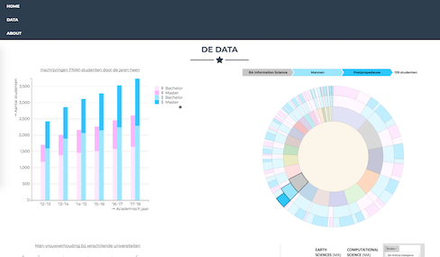

**BESCHRIJVING WEBSITE**
----------------  
Dit project visualiseert de demografische ontwikkelingen van de Universiteit van Amsterdam. Het brengt het aantal inschrijvingen per studie in kaart en focust daarbij op de Bachelor- en Masterstudenten aan de bètafaculteit FNWI. Door de afgelopen 5 jaar in de verschillende grafieken naast elkaar te zetten, kunnen er vergelijkingen worden gedaan, niet alleen tussen studies, maar ook tussen verschillende academische jaren.

**DESIGN**
----------------  
**OVERVIEW**

De website is in tweeën te delen: lay-out/informatie en de datasets.
1. De lay-out wordt gemaakt door een HTML-bestand (index.html) en bijbehorende freelancer.css. In de HTML worden scripts aangeroepen die de visualisaties maken.
2. Die scripts staan in drie Javascript-bestanden, één voor elke visualisatie van de datasets. De stijl van de daarin gemaakte svgs wordt beschreven in het styles.css-bestand. Verder staan de data, die gebruikt worden door de de Javascript-bestanden in een apart mapje met CSV- en JSON-bestanden.

Qua GitHub is er ook nog een mapje met HTML (waarin een begin van een tabel is gemaakt) en een mapje met een python-bestand, waarmee CSV naar JSON geconvert kan worden. Deze zijn echter in het proces gebruikt en worden niet in de website gebruikt.

**DETAILS**  
Voor elke datavisualisatie is een apart Javascript-bestand, waarin voor elke grafiek een eigen svg wordt aangemaakt met een unieke dataset in JSON-formaat. De bestanden lijken qua indeling op elkaar: 
1. Eerst wordt er overal een svg aangemaakt met de juiste schalen en globale variabelen. 
2. Daarna worden de svg's aangemaakt en op de juiste plek in de HTML gezet. 
3. Dan worden daarna de data ingeladen en verwerkt in de svg met stijlattributen. 
4. Tot slot heeft elke visualisatie ook een aantal interactieve functies, die worden beschreven in tooltips, en functies zoals mouseover.

(Dat is in ieder geval het ideaal; er valt in sommige files qua indeling nog wel wat te verbeteren, omdat 3 en 4 nog wel eens door elkaar staan.)

**CHALLENGES**
----------------  
**1. De rest van de Minor een jaar geleden gedaan hebben.**  
Hier had ik vooral de eerste twee weken nogal last van. Hoewel ik sinds de Minor eind 2016 wel een stuk meer geprogrammeerd heb, was dat vooral meer 'technisch' dingen bouwen, en niet in Javascript en HTML werken. Hierdoor duurde het even voordat ik de basis onder de knie had en had ik 'zelfs' met een simpele staafdiagram moeite in de eerste week. Ik heb mijn plan hier echter niet op aangepast, maar juist geprobeerd mezelf uit te dagen met wat ik ging maken. Toen Javascript wat soepeler ging, heb ik besloten juist extra's toe te voegen aan de visualisaties. In plaats van een simpele staafdiagram heb ik hem dus stacked & grouped gemaakt. In plaats van een cirkeldiagram heb ik de sunburst gemaakt, en daarnaast later nog een extra hover en legenda toegevoegd, toen de basis niet zo moeilijk bleek. Ook bij de lijndiagram heb ik geprobeerd met het aan-/uitzetten het programmeren wat lastiger te maken. Het leek me dat ik van het 'verdiepen' van simpele visualisaties meer zou leren, dan als ik iets zou doen met een originele API, waar ik dan vooral veel tijd in zou moeten steken om uit te vinden hoe het werkt.

**2. De functies rondom SVGs & Javascript-files opbouwen.**  
Het is me na vier weken wel een stuk duidelijker, maar ik snap nog steeds niet altijd hoe d3, Javascript en HTML nou samenwerken. Zo waren de coördinaten vinden van de verschillende rechthoeken in de staafdiagram echt een uitdaging, en daar heb ik meer uren dan me lief is in moeten steken. Ik heb het uiteindelijk wel werkend gekregen, maar de code is echt een zooitje. De bedoeling is natuurlijk dat je functies mooi gescheiden zijn, maar mijn staafdiagram is één grote functie. Als ik de 'laad & show data' in een aparte functie wou gooien, verdwenen ze van het scherm en ik heb het niet op kunnen lossen. (Maar goed, het werkt in de huidige vorm, dus dat is wel fijn.)

**3. Onderschat hoeveel bugs en i's er waren om puntjes op te zetten.**  
Mijn plan was aan het einde van week drie om nog in de laatste week een tabel te gaan maken, die stond namelijk nog in mijn originele plan (wel als optioneel). Op dat moment had ik namelijk drie werkende visualisaties en leek het allemaal wel goed te gaan. Echter heb ik bij het opschonen van de code gezien, dat er eigenlijk nog wel veel te doen was. Er deden zich steeds weer nieuwe problemen voor, waardoor ik er uiteindelijk voor heb gekozen om het begin van de tabel die ik gemaakt had, weg te gooien en te focussen op dat wat ik al had. Hier heb ik misschien wel in algemene zin het meeste van geleerd: je code kan je echt 100 keer bijwerken en je zal elke keer weer nieuwe foutjes vinden.

**4. De website in elkaar zetten.**  
Dit sluit enigszins aan bij 1 en 3; HTML is behoorlijk anders dan de andere programmeertalen waarmee ik in contact ben gekomen. Als je het kant-en-klaar ziet is het te begrijpen, maar om het zelf op te bouwen is toch iets anders. Ik heb er uiteindelijk voor gekozen om een template van Bootstrap te nemen en die aan te passenm, zodat ik op een voorbeeld kon voortbouwen. Echter stond er zoveel in dat template wat ik niet nodig had, dat ik vooral veel tijd kwijt was aan het uitzoeken wat ik allemaal weg kon gooien. Je wilt (natuurlijk) wel een mooie lay-out hebben en ik heb dan ook misschien meer tijd gestoken in dat netjes te krijgen dan mijn code qua stijl echt netjes te krijgen.

**VERANDERINGEN**
------------------
**Verschillen met het originele design:**  
Van het originele design document is het meest intact gebleven. De algemene lay-out heb ik wel veranderd, aangezien dat slechts een basis was en omdat mijn laptopbeeldscherm niet zo breed als een A4'tje was. Daarnaast heb ik het eerste niveau van de sunburst weggehaald, op aanraden van de presentaties op de derde vrijdag. Er stonden te veel data in. Hoewel het wel een mooie visualisatie was, waren de data niet meer overzichtelijk. Eigenlijk heb ik vooral dingen veranderd/toegevoegd om de visualisaties te verduidelijken: legenda's, kleurtjes, tooltips en interactie stonden allemaal in het teken van uitleg. 

**Mogelijke aanpassingen in de toekomst:**  
Als ik meer tijd had gehad, had ik nog een dag of twee naar de stijl van mijn code willen kijken. En daarnaast vooral nog een tabel interactief en werkende willen krijgen. Ik vind het jammer dat die niet is gelukt en dat er nu een afbeelding staat als voorbeeld van wat ik eigenlijk had willen maken. De lijngrafiek had ik mogelijk ook wel anders gedaan. Ik vind hem niet echt mooi en er staan misschien te veel data in, als je hem in zijn geheel ziet (alhoewel daar natuurlijk alle interactiviteit voor is). Natuurlijk is het altijd mooier in je hoofd als je gewoon zou kunnen tekenen wat je zou willen maken, in plaats van gebruik te moeten maken van d3. Toch denk ik dat ik wel redelijk 'naar mijn kunnen' heb gepresteerd en ben ik trots op het resultaat! 
